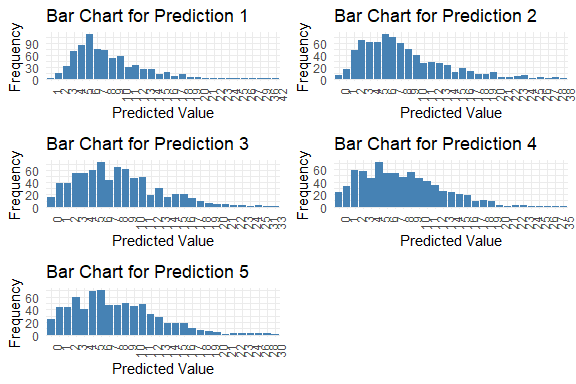

<!--  README.md is generated from README.Rmd. Please edit that file -->

The First-order Integer-valued Autoregressive (INAR(1)) model with
zero-inflated (ZI-INAR(1)) and hurdle (H-INAR(1)) innovations is widely
used in studying integer-valued time-series data, such as crime count
and heatwave frequency. This work implemented the INAR(1) models in
Stan.

## Installation

You can install ZIHINAR1 from GitHub with:

``` r
remotes::install_github("fushengyy/ZIHINAR1")
```

$$Available Soon$$ Or you can install the released version of
HeckmanStan from [CRAN](https://CRAN.R-project.org) with:

``` r
install.packages("ZIHINAR1")
```

## Basic Features get_stanfit()

The package contains main function named get_stanfit().

``` r
stan_fit <- get_stanfit(mod_type, distri, y, n_pred = 4,
                        thin = 2, chains = 1, iter = 2000, warmup = iter/2,
                        seed = NA)
```

- mod_type: Character string indicating the model type. Use “zi” for
  zero-inflated models and “h” for hurdle models.

- distri: Character string specifying the distribution. Options are
  “poi” for Poisson or “nb” for Negative Binomial.

- y: A numeric vector of integers representing the observed data.

- n_pred: Integer specifying the number of time points for future
  predictions (default is 4).

- thin: Integer indicating the thinning interval for Stan sampling
  (default is 2).

- chains: Integer specifying the number of Markov chains to run (default
  is 1).

- iter: Integer specifying the total number of iterations per chain
  (default is 2000).

- warmup: Integer specifying the number of warmup iterations per chain
  (default is iter/2).

- seed: Numeric seed for reproducibility (default is NA).

## Example

The following are examples showing how to fit the INAR(1) model when
data is generated from a zero-inflated Negative Binomial (ZINB)
distribution.

``` r
library(ZIHINAR1)
y_data <- data_simu(n = 100, alpha = 0.5, rho = 0.3, theta = c(5, 2), 
                    mod_type = "zi", distri = "nb")
stan_fit <- get_stanfit(mod_type = "zi", distri = "nb", y = y_data, n_pred = 5, 
                        iter = 2000, chains = 1, warmup = 500, 
                        thin = 2, seed = 42)
#> 
#> SAMPLING FOR MODEL 'anon_model' NOW (CHAIN 1).
#> Chain 1: 
#> Chain 1: Gradient evaluation took 0.002477 seconds
#> Chain 1: 1000 transitions using 10 leapfrog steps per transition would take 24.77 seconds.
#> Chain 1: Adjust your expectations accordingly!
#> Chain 1: 
#> Chain 1: 
#> Chain 1: Iteration:    1 / 2000 [  0%]  (Warmup)
#> Chain 1: Iteration:  200 / 2000 [ 10%]  (Warmup)
#> Chain 1: Iteration:  400 / 2000 [ 20%]  (Warmup)
#> Chain 1: Iteration:  501 / 2000 [ 25%]  (Sampling)
#> Chain 1: Iteration:  700 / 2000 [ 35%]  (Sampling)
#> Chain 1: Iteration:  900 / 2000 [ 45%]  (Sampling)
#> Chain 1: Iteration: 1100 / 2000 [ 55%]  (Sampling)
#> Chain 1: Iteration: 1300 / 2000 [ 65%]  (Sampling)
#> Chain 1: Iteration: 1500 / 2000 [ 75%]  (Sampling)
#> Chain 1: Iteration: 1700 / 2000 [ 85%]  (Sampling)
#> Chain 1: Iteration: 1900 / 2000 [ 95%]  (Sampling)
#> Chain 1: Iteration: 2000 / 2000 [100%]  (Sampling)
#> Chain 1: 
#> Chain 1:  Elapsed Time: 3.767 seconds (Warm-up)
#> Chain 1:                9.449 seconds (Sampling)
#> Chain 1:                13.216 seconds (Total)
#> Chain 1:
get_est(distri = "nb", stan_fit = stan_fit)
#> 
#> 
#> Table: Parameter Estimates
#> 
#>             Mean       SD   Median     Q2.5    Q97.5     Rhat   95%_HPD_Lower   95%_HPD_Upper
#> -------  -------  -------  -------  -------  -------  -------  --------------  --------------
#> alpha     0.5434   0.0407   0.5450   0.4620   0.6123   1.0010          0.4605          0.6113
#> rho       0.2573   0.1131   0.2506   0.0404   0.4742   1.0006          0.0437          0.4753
#> lambda    4.9955   0.7772   4.9750   3.6025   6.5105   0.9987          3.6044          6.5105
#> phi       2.2278   1.2160   1.9962   0.7745   4.9245   0.9993          0.5618          4.3624
get_mod_sel(y = y_data, mod_type = "zi", distri = "nb", stan_fit = stan_fit)
#> 
#> 
#> Table: Model Selection Criteria
#> 
#>      EAIC       EBIC        DIC      WAIC1      WAIC2
#> ---------  ---------  ---------  ---------  ---------
#>  554.6341   565.0146   555.8627   550.0862   550.3367
get_pred(stan_fit = stan_fit)
#> 
#> 
#> Table: Summary of Predictions
#> 
#>             Mode   Median   IQR   Min   Max
#> ---------  -----  -------  ----  ----  ----
#> y_pred.1       6      7.0     5     1    42
#> y_pred.2       6      7.0     7     0    38
#> y_pred.3       6      7.5     7     0    33
#> y_pred.4       5      7.0     7     0    35
#> y_pred.5       6      7.0     7     0    30
```


